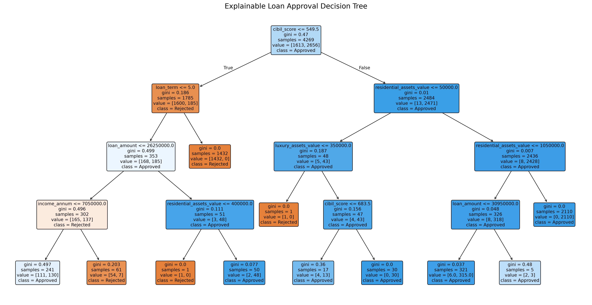

# Explainable Loan Rejection Simulator

This project is a loan evaluation web application tailored for the Indian market. It evaluates loan applications based on historical banking data and provides fully explainable decisions.

This simulator is built using a `scikit-learn` Decision Tree. This ensures that every time an application is evaluated, the system can output the exact logical rules that led to the approval or rejection (for example: "CIBIL score is <= 550 and loan term is > 5 years").

## Features
- **Decision Tree Model**: Uses a straightforward Decision Tree algorithm (max depth of 4) to ensure all outcomes are simple and fully explainable to the applicant.
- **Indian Market Context**: Evaluates applications based on relevant factors like CIBIL scores and Rupee (₹) asset values.

## How It Works
Here is the visual representation of the exact logical rules the model learns to evaluate applications:



## How to Run Locally

1. Install the required Python packages:
   ```bash
   pip install -r requirements.txt
   ```
2. You can also simply double-click the `start.bat` file to automatically install requirements and start the server.
3. Open your browser and go to `http://127.0.0.1:5000`.
